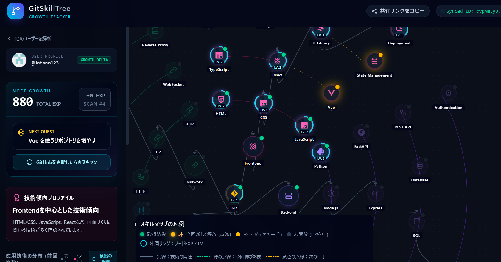

# GitSkillTree 🌲

GitHubに残っている開発記録を、次の学習へ向かう体験に変えるスキル可視化アプリです。

GitHubユーザー名を入力すると、公開リポジトリの言語、依存パッケージ、技術固有ファイルを解析し、検出できた技術をインタラクティブなスキルツリーとして表示します。

**公開デモ:** [https://gitskilltree.web.app/](https://gitskilltree.web.app/)

---

## 主な機能

### GitHubリポジトリ解析

- 公開リポジトリを最大100件取得
- フォークを除外し、選定した最大8件を詳細解析
- 主要言語、依存パッケージ、技術固有ファイルから使用技術を判定
- GitHub APIの残量を考慮し、取得済みの部分結果を保持

### 根拠を重視した技術検出

ノードの解除は、次の強い証拠だけを使用する決定的なルールで行います。

- GitHubが返す主要言語との完全一致
- マニフェストに記載された依存パッケージとの完全一致
- 技術固有ファイルとの一致
- 言語に対応するソースファイル

リポジトリ名、説明、README、関連ノード、AIの推測は検出根拠に使用しません。Gitノードはすべての解析で解除されます。

### インタラクティブなスキルツリー

- 習得済み、今回新しく解除、おすすめ、未解除を色と線で表示
- ノードごとのEXPとレベルを表示
- ドラッグ、ズーム、ノード詳細表示に対応
- 初回表示ではGitノードを中心に表示
- 狭い画面では左パネルを自動的に閉じ、ツリーの表示領域を確保

### 成長・差分表示

- 解析結果と成長状態をCloud Firestoreへ保存
- 同じGitHubユーザーの前回結果を読み込み、今回新しく検出された技術を表示
- 前回解析時刻以降に更新されたリポジトリを優先して詳細解析
- 公開GitHub Eventsから前回解析後の活動を取得
- 技術ごとのEXP、レベル、スキャン回数を継続

> 差分解析は公開情報を対象とします。GitHub Eventsは直近30件までのため、すべての活動を完全に取得するものではありません。

### AIによる説明生成

決定的なルールで算出した検出結果をもとに、Geminiが説明文を生成します。AIは技術検出やノード解除の判定には使用しません。

---

## 画面

### ホーム画面

GitHubユーザー名を入力して解析を開始します。


### 解析結果

技術傾向、成長フィードバック、インタラクティブなスキルツリーを表示します。



---

## システム構成

- ブラウザからのGitHub APIリクエストは、Firebase Functionsの`githubApi`を経由
- Geminiの説明生成は、Firebase Functionsの`generateExplanation`を経由
- Gemini APIキーとGitHub App秘密鍵はFirebase Secret Managerで管理
- 解析履歴と成長状態はCloud Firestoreの`scans`コレクションへ保存
- フロントエンドはFirebase Hostingで配信
- Functionsのリージョンは`asia-northeast1`

ブラウザへGemini APIキーやGitHub App秘密鍵を配布しない構成です。

---

## 技術スタック

- **フロントエンド:** React 19、TypeScript、Vite 8
- **スタイリング:** Tailwind CSS 4
- **スキルツリー:** React Flow (`@xyflow/react`)
- **チャート:** Recharts
- **アイコン:** Lucide React、React Icons
- **バックエンド:** Firebase Functions v2 / Node.js 22
- **データベース:** Cloud Firestore
- **AI:** Google Gemini (`gemini-3.1-flash-lite`)
- **ホスティング:** Firebase Hosting
- **テスト:** Node.js Test Runner、検出ハーネス
- **Lint:** Oxlint

---

## ローカル開発

### 必要環境

- Node.js 22 推奨
- npm
- Firebaseプロジェクト

### セットアップ

```bash
npm install
npm --prefix functions install
```

ルートに`.env`を作成し、Webアプリ用のFirebase公開設定を記述します。

```env
VITE_FIREBASE_API_KEY="YOUR_FIREBASE_API_KEY"
VITE_FIREBASE_AUTH_DOMAIN="YOUR_FIREBASE_AUTH_DOMAIN"
VITE_FIREBASE_PROJECT_ID="YOUR_FIREBASE_PROJECT_ID"
VITE_FIREBASE_STORAGE_BUCKET="YOUR_FIREBASE_STORAGE_BUCKET"
VITE_FIREBASE_MESSAGING_SENDER_ID="YOUR_FIREBASE_MESSAGING_SENDER_ID"
VITE_FIREBASE_APP_ID="YOUR_FIREBASE_APP_ID"
VITE_FIREBASE_MEASUREMENT_ID="YOUR_FIREBASE_MEASUREMENT_ID"
```

`GEMINI_API_KEY`と`GITHUB_APP_PRIVATE_KEY`はフロントエンドの`.env`へ置かず、Firebase FunctionsのSecretとして管理します。

### 起動

```bash
npm run dev
```

通常は[http://localhost:5173](http://localhost:5173)で起動します。

### テスト・品質確認

```bash
# ソーステスト
npm test

# ノード検出ハーネス
npm run harness:test

# テスト、検出ハーネス、Lint、ビルドを一括実行
npm run harness

# Functions
npm --prefix functions test
npm --prefix functions run build
```

公開リポジトリを使って検出結果を調査する場合は、リクエスト上限を管理する専用コマンドを使用します。

```bash
npm run harness:scan -- <GitHubユーザー名>
```

---

## ビルドとデプロイ

### フロントエンドのビルド

```bash
npm run build
```

生成物は`dist/`へ出力されます。

### Hostingのみデプロイ

```bash
npx -y firebase-tools@latest deploy --only hosting
```

### Functionsのみデプロイ

```bash
npx -y firebase-tools@latest deploy --only functions
```

### HostingとFunctionsをまとめてデプロイ

```bash
npm run build
npx -y firebase-tools@latest deploy --only hosting,functions
```

HostingのデプロイだけではFunctionsの変更は反映されません。

---

## 現在の制約

- 公開リポジトリのみ解析対象
- リポジトリ取得は最大100件、詳細解析は最大8件
- GitHub Eventsは直近30件まで
- 大きなリポジトリではGitHubのTree APIが一部を省略する場合がある
- 技術傾向チャートはGitHub上で検出できた技術の相対分布であり、能力値や習熟度の断定ではない
- スマートフォンでも表示できますが、快適な操作にはPCを推奨

検出数を増やすことより、根拠を確認できる正しい検出を優先しています。
