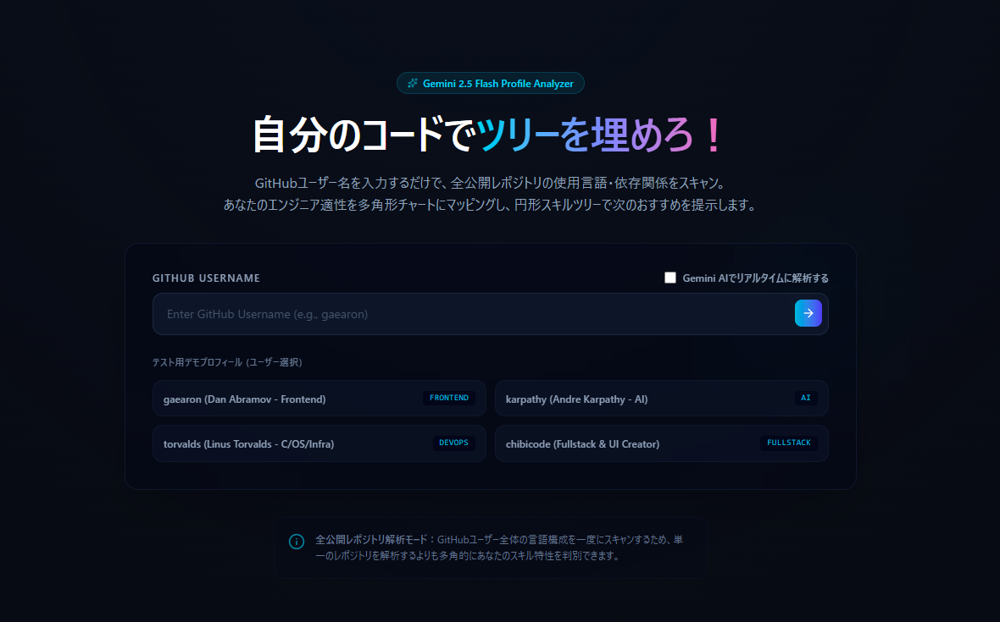
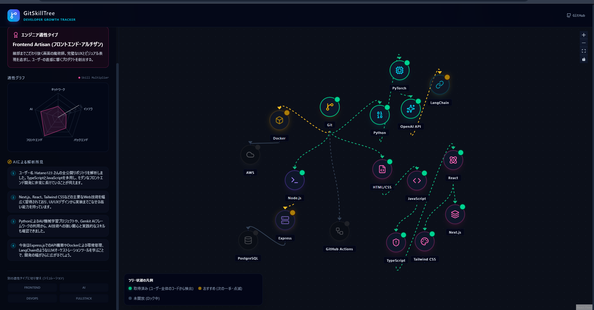

# GitSkillTree 🌲

「自分のコードでツリーを埋めろ！次の一手がわかる成長トラッカー」  
GitHubユーザーネームを入力するだけで、全公開レポジトリの使用言語・依存パッケージ構成をスキャンし、あなたのエンジニア適性を多角形チャート（レーダーチャート）とインタラクティブな円形スキルツリーで可視化するアプリケーションです。

---

## 🚀 主要機能
1. **GitHubプロフィール一括スキャン**:
   - ユーザーネームを入力するだけで、全公開リポジトリ（最大100件）と言語の統計情報を抽出。
   - スター数上位のレポジトリから主要なパッケージ構成（`package.json` 等）を自動解析。
2. **Gemini 2.5 Flash によるスキル分析**:
   - 抽出したリポジトリメタデータを **Gemini 2.5 Flash API** が詳細にプロファイリング。
   - 開発者の適性スコア（インフラ、バックエンド、フロントエンド、AI、ネットワーク）を算出します。
3. **インタラクティブな円形スキルツリー**:
   - 内側（基礎）から外側（応用・高度技術）へ向かって放射状に広がる、美しい同心円レイアウト。
   - 習得済みノードは緑に、次におすすめの技術は黄色（点滅アニメーション）で表示され、マウスホバーで技術の詳細解説を確認できます。
4. **Firebaseデータ管理**:
   - 解析結果は Firebase Firestore に自動で同期・保存され、一意なスキャンIDが発行されます。

---

## 📸 画面紹介

### ① ホーム画面 (ユーザー入力 / 解析中)
シンプルなUIでGitHubユーザー名の入力を受け付け、解析を実行します。


### ② 結果表示画面 (適性チャート & スキルツリー)
左側にレーダーチャートとAIによる詳細な分析コメント、右側にドラッグ・ズーム可能な円形スキルツリーが表示されます。


---

## 🛠️ 環境構築・起動方法

### 前提条件
- **Node.js**: v18.0.0 以上 (Vite 8 の動作要件)
- **npm**: v9.0.0 以上

---

### 1. 依存パッケージのインストール
プロジェクトのルートディレクトリで以下を実行し、依存パッケージをインストールします。
```bash
npm install
```

### 2. 環境変数の設定
ルートディレクトリに `.env` ファイルを作成（または `.env.example` からコピー）し、各種APIキーや構成情報を記述します。

```env
# Firebase Configuration (Firebase Console > プロジェクト設定 から取得)
VITE_FIREBASE_API_KEY="YOUR_FIREBASE_API_KEY"
VITE_FIREBASE_AUTH_DOMAIN="YOUR_FIREBASE_AUTH_DOMAIN"
VITE_FIREBASE_PROJECT_ID="YOUR_FIREBASE_PROJECT_ID"
VITE_FIREBASE_STORAGE_BUCKET="YOUR_FIREBASE_STORAGE_BUCKET"
VITE_FIREBASE_MESSAGING_SENDER_ID="YOUR_FIREBASE_MESSAGING_SENDER_ID"
VITE_FIREBASE_APP_ID="YOUR_FIREBASE_APP_ID"
VITE_FIREBASE_MEASUREMENT_ID="YOUR_FIREBASE_MEASUREMENT_ID"

# Gemini API Key (Google AI Studio から取得)
VITE_GEMINI_API_KEY="YOUR_GEMINI_API_KEY"
```
*※注: `.env` はセキュリティのため、Gitリポジトリにはコミットされません。実際のAPI情報を公開リポジトリへ登録しないようご注意ください。*

---

### 3. 各種コマンド

#### 開発用サーバーの起動
ローカル開発サーバーを起動します（デフォルトでは `http://localhost:5173` で起動します）。
```bash
npm run dev
```

#### 本番用ビルドの生成
プロジェクトを本番用にコンパイルおよびビルドします。成果物は `dist/` ディレクトリに出力されます。
```bash
npm run build
```

#### ビルド成果物のローカルプレビュー
本番用にビルドされた `dist/` ディレクトリの成果物をローカル環境で起動・テストします。
```bash
npm run preview
```

---

### 4. Firebase Hosting へのデプロイ

ビルドした静的ファイルを Firebase Hosting にデプロイする場合は、以下の手順を実行します。

1. **Firebase CLI のセットアップ**
   ```bash
   npx firebase login
   ```

2. **プロジェクトの紐付け** (まだの場合)
   ```bash
   npx firebase use --add
   ```

3. **ビルドしてデプロイ**
   ```bash
   npm run build
   npx firebase deploy
   ```

---

## 🧬 技術スタック
- **フロントエンド**: React (Vite) + TypeScript
- **スタイリング**: Tailwind CSS (v4)
- **アイコン**: lucide-react
- **多角形チャート**: recharts
- **インタラクティブ・スキルツリー**: @xyflow/react (React Flow)
- **AIエンジン**: Google Gemini API (`gemini-2.5-flash`)
- **データベース & ホスティング**: Firebase (Firestore)
